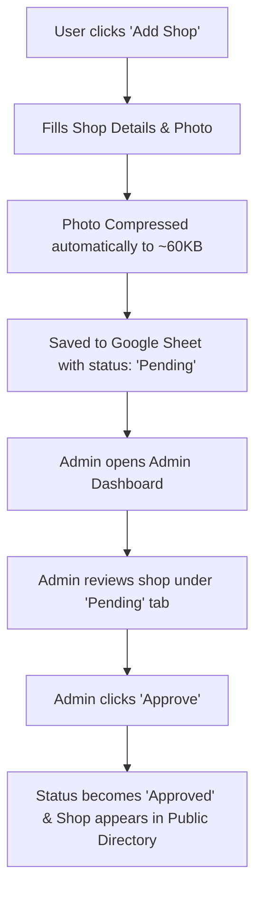

# 📖 Burkit SmartCity - System & User Manual (கையேடு)

A complete guide for setting up, managing, testing, and deploying the **Burkit SmartCity** local marketplace application.

---

## 🚀 1. Quick Start Guide (உடனடி பயன்பாட்டு வழிகாட்டி)

### Running Frontend Locally:
1. Open terminal in the project directory:
   ```bash
   cd frontend
   npm run dev -- --host
   ```
2. Open your browser at `http://localhost:5173`.

---

## 🛠️ 2. Admin & Account Credentials (நிர்வாகி கணக்கு விவரங்கள்)

### Default Admin Mobile Numbers:
- **`9385497906`** (Main Admin)
- **`9999999999`** (Fallback Admin)

### How to Login as Admin:
1. Open the app and click **Profile / Login**.
2. Enter Mobile Number: `9385497906` or `9999999999`.
3. Enter OTP sent to email (or default verification code).
4. Go to **Profile** ➔ Click **Admin Dashboard** button.

---

## 🏪 3. Shop Registration & Approval Flow (கடை பதிவு & அனுமதி செயல்முறை)



### Steps to Register a New Shop:
1. Go to **Shops** tab on navigation bar ➔ Click **+ Add Shop** (or **+ Register Shop**).
2. Fill in:
   - **Shop Name** (e.g., ஸ்ரீ முருகன் மளிகை கடை)
   - **WhatsApp Number** (e.g., 9876543210)
   - **Category** (Grocery, Hotel, Medical, Electronics, etc.)
   - **Village/Location** (e.g., Burkitmanagaram)
   - **Shop Photo** *(Auto-compressed for fast loading)*
3. Click **Submit**. Your shop will be sent for Admin Approval.

### Steps for Admin to Approve Shops/Products:
1. Login with Admin Mobile `9385497906`.
2. Go to **Profile** ➔ **Admin Dashboard**.
3. Select **Manage Shops** or **Marketplace Items**.
4. Under the **Pending** tab, review the newly added item.
5. Click **Approve**.
   - A green toast message appears: `✅ Shop Approved successfully! Moved to Approved tab.`
   - The shop moves to the **Approved** tab and is immediately visible to all users.

---

## ☁️ 4. Backend & Google Apps Script Setup (Google Apps Script அமைப்புகள்)

### Step-by-Step Google Apps Script Deployment:

1. **Open Google Sheets**:
   - Go to [sheets.google.com](https://sheets.google.com) and open your spreadsheet.

2. **Open Apps Script Editor**:
   - Menu bar: **Extensions** ➔ **Apps Script**.

3. **Update Code**:
   - Copy the entire contents from `backend/Code.gs`.
   - Select all existing code in the Apps Script editor and replace it.

4. **Deploy a New Version (CRITICAL STEP)**:
   - Click **Deploy** (top right) ➔ **Manage deployments**.
   - Click the ✏️ **Pencil (Edit)** icon next to your active Web App deployment.
   - Under **Version**, select **New version**.
   - Click **Deploy**.
   - Copy the **Web App URL** (ends in `/exec`).

5. **Connect Frontend to Backend**:
   - Open `frontend/.env`.
   - Update `VITE_API_URL`:
     ```env
     VITE_API_URL=https://script.google.com/macros/s/YOUR_DEPLOYMENT_ID/exec
     ```

---

## 🔧 5. Troubleshooting & FAQ (அடிக்கடி கேட்கப்படும் கேள்விகள்)

| Issue | Cause | Solution |
| :--- | :--- | :--- |
| **Approve click does not update** | Google Apps Script running an older deployed version. | Perform **Deploy ➔ Manage deployments ➔ Edit ➔ New Version ➔ Deploy**. |
| **Shop Add fails / Timeout** | High-resolution phone camera photos exceeding memory quota. | Handled automatically! Images are now auto-compressed to ~60KB before sending. |
| **Cannot see newly approved shop** | Viewing 'Pending' tab instead of 'Approved' tab or directory. | Switch to **Approved** tab in Admin Dashboard or open **Shops** page. |
| **Missing Google Sheet tabs** | Sheet tabs (`Shops`, `ShopProducts`) not created. | Handled automatically! `Code.gs` auto-creates missing sheet tabs on the fly. |

---

## 📦 6. Production Build Command

To build static production bundle for deployment (Vercel, Netlify, Firebase):

```bash
cd frontend
npm run build
```
Output files are saved in `frontend/dist/`.
